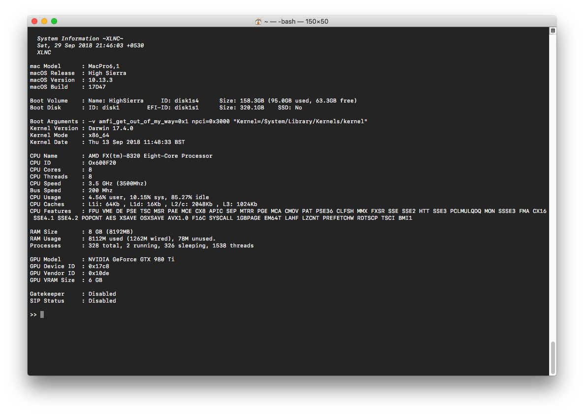

# UsefullScipts
A repo of small useful scripts that i wrote.

- [`sysinfo`](sysinfo.sh) :`Provides a summary of information about macOS system.`



```bash
###Usage
bash <(curl -s https://raw.githubusercontent.com/XLNCs/UsefullScripts/master/sysinfo.sh)
```