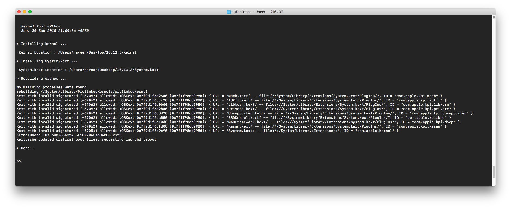

# UsefullScipts
A repo of small useful scripts that i wrote.

- [`sysinfo`](sysinfo.sh) :`Provides a summary of information about macOS system.`

```bash
###Usage
bash <(curl -s https://raw.githubusercontent.com/XLNCs/UsefullScripts/master/sysinfo.sh)
```


----------

- [`cpunamefix`](cpunamefix.sh) :`Set the correct or a custom CPU name in 'About This Mac`

```bash
###Usage
bash <(curl -s https://raw.githubusercontent.com/XLNCs/UsefullScripts/master/cpunamefix.sh)
```
``` NOTE : If your 'About This Mac' window still doesnt show the correct CPU name then set the CPU 'Type' to 'Unknown' in your clover config.plist and reboot.```


----------

- [`kerntool`](kerntool.sh) :`Rebuild kernel caches or install kernel on macOS`

```bash
###Usage
curl -s -o ~/Desktop/kerntool.sh https://raw.githubusercontent.com/XLNCs/UsefullScripts/master/kerntool.sh && 
chmod +x ~/Desktop/kerntool.sh

Usage:  kerntool.sh [ -r | -k | -ke ]
      ./kerntool.sh -r                                      :  Rebuilds caches only
      ./kerntool.sh -k <kernel-file>                        :  Installs provided kernel then rebuilds caches
      ./kerntool.sh -ke <kernel-file> <System.kext-file>    :  Installs provided kernel and system.kext then rebuilds caches

Example:
      ./kerntool.sh -k ~/Desktop/kernel
      ./kerntool.sh -k ~/Desktop/kernel.test                   [ Use Bootflag : kcsuffix=test ]
      ./kerntool.sh -ke ~/Desktop/kernel ~/Desktop/System.kext

```


