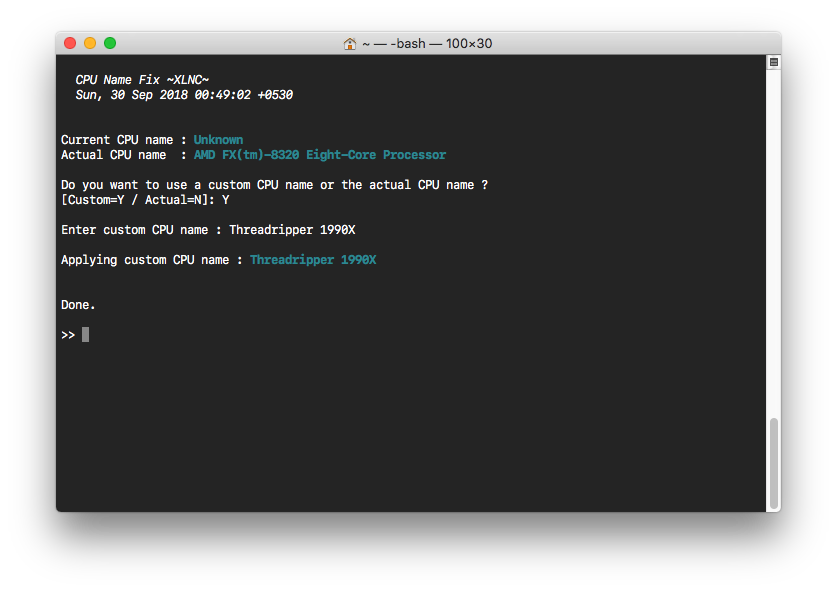

# UsefullScipts
A repo of small useful scripts that i wrote.

- [`sysinfo`](sysinfo.sh) :`Provides a summary of information about macOS system.`

<<<<<<< HEAD
```bash
###Usage
bash <(curl -s https://raw.githubusercontent.com/XLNCs/UsefullScripts/master/sysinfo.sh)
```


----------

- [`cpunamefix`](cpunamefix.sh) :`Set the correct or a custom CPU name in 'About This Mac`



```bash
###Usage
bash <(curl -s https://raw.githubusercontent.com/XLNCs/UsefullScripts/master/cpunamefix.sh)
```
=======
```bash
###Usage
bash <(curl -s https://raw.githubusercontent.com/XLNCs/UsefullScripts/master/sysinfo.sh)
```


>>>>>>> 8ae38d670e287c50c63c29aca7eb533163922ef7
